# Lab7WEB
## Praktikum 7
# Risyad Bima Nugraha
## 312110039
## TI.21.B1
# UNIVERSITAS PELITA BANGSA

## Langkah 1
### Install XAMPP
```
Unduh XAMPP dari situs resminya, kemudian ekstrak file tersebut dan simpan di directory yang di inginkan. Misal di Windows (C:\xampp)
```
## Langkah 2
### Menjalankan Web Server
Jalankan program tersebut kemudian tekan tombol `Start` pada menu `Apache` seperti berikut.
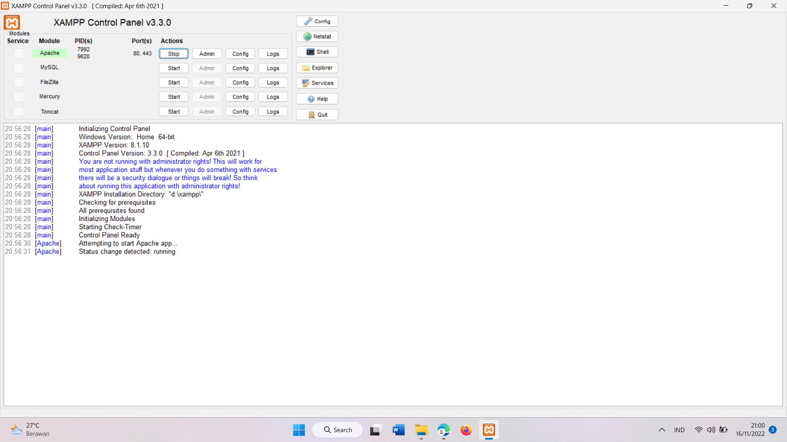

## Langkah 3
### Memulai PHP
Buatlah folder  `lab7_php_dasar` pada directory web server (C:\xampp\htdocs) dan untuk mengakses directory tersebut pada web server dengan mengakses URL: http://localhost/Lab7_php_dasar/ seperti berikut.
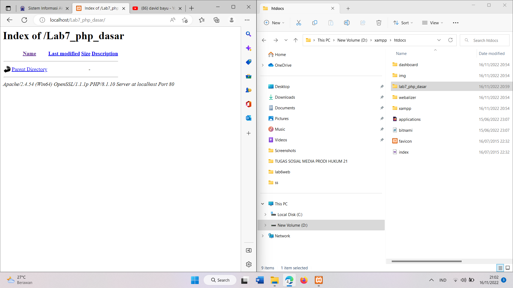

## Langkah 4
### PHP Dasar
Buatlah file baru dengan nama `php_dasar.php` pada directory tersebut.
Kemudian untuk mengakses hasilnya melalui URL: http://localhost/Lab7_php_dasar/php_dasar.php
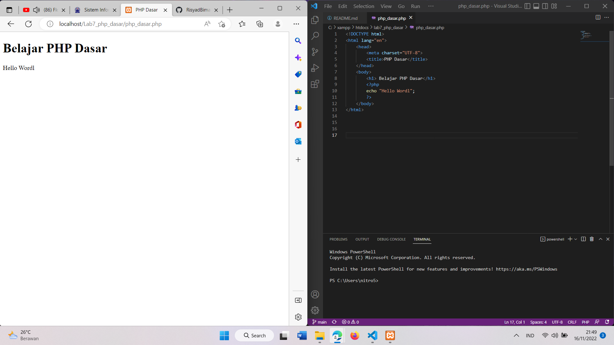

## Langkah 5
### Variable PHP
Menambahkan variable pada program seperti berikut.
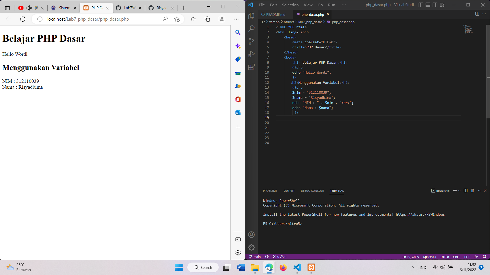

## Langkah 6
### Predefine Variable $_ GET
Menambahkan kode pada program seperti berikut.
Kemudian untuk mengaksesnya gunakan URL : http://localhost/Lab7_php_dasar/php_dasar.php?nama=Risyadbima
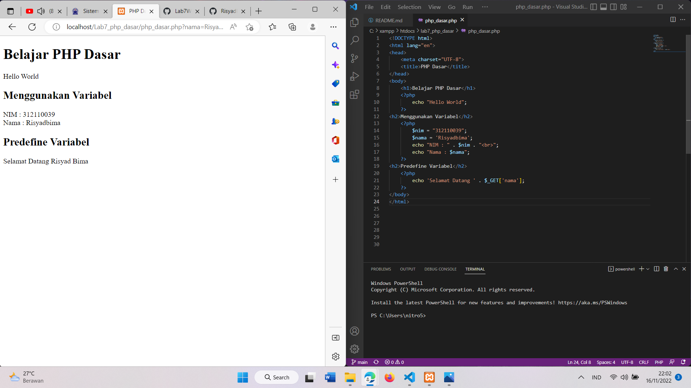

## Langkah 7
### Membuat Form Input
Menambahkan kode pada program seperti berikut.


## Langkah 8
### Operator
Menambahkan kode pada program seperti berikut.
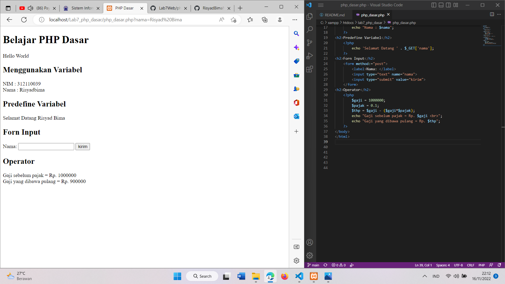

## Langkah 9
### Kondisi IF
Menambahkan kode pada program seperti berikut
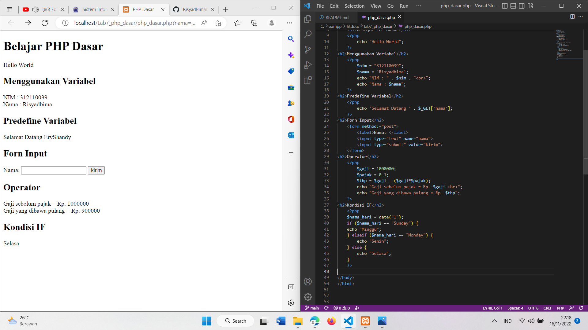

## Langkah 10
### Kondisi Switch
Menambahkan kode pada program seperti berikut.
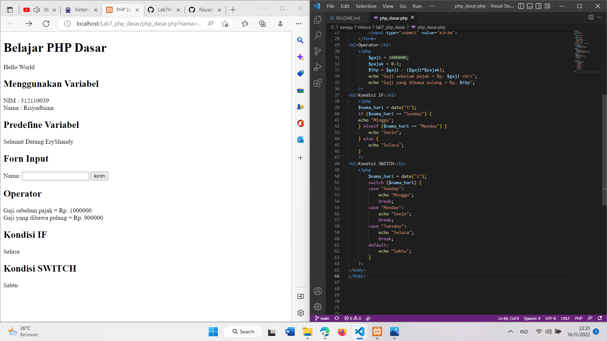

## Langkah 11
### Perulangan For
Menambahkan kode pada program seperti berikut
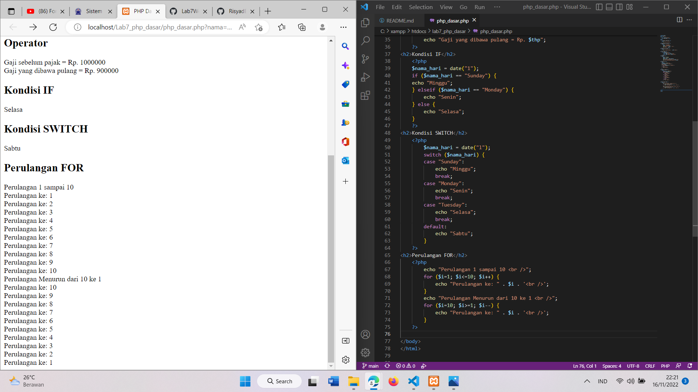

## Langkah 12
### Perulangan While
Menambahkan kode pada program seperti berikut.
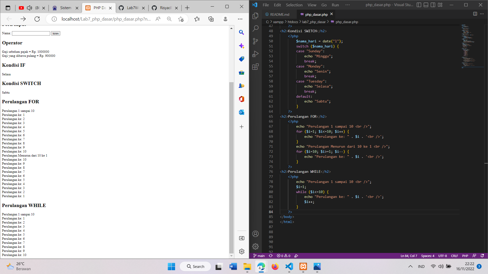

## Langkah 13
### Perulangan Dowhile
Menambahkan kode pada program seperti berikut.


# PERTANYAAN DAN TUGAS
## Buatlah program PHP sederhana dengan menggunakan form input yang menampilkan nama, tanggal lahir dan pekerjaan. Kemudian tampilkan outputnya dengan menghitung umur berdasarkan inputan tanggal lahir. Dan pilihan pekerjaan dengan gaji yang berbeda-beda sesuai pilihan pekerjaan.

# JAWABAN
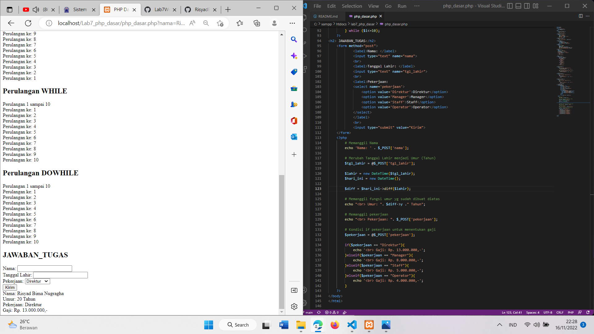
